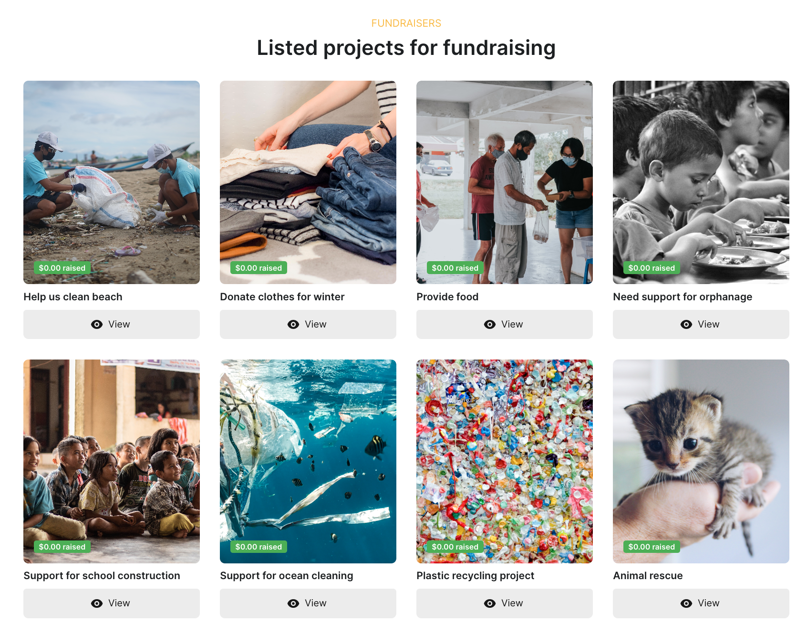
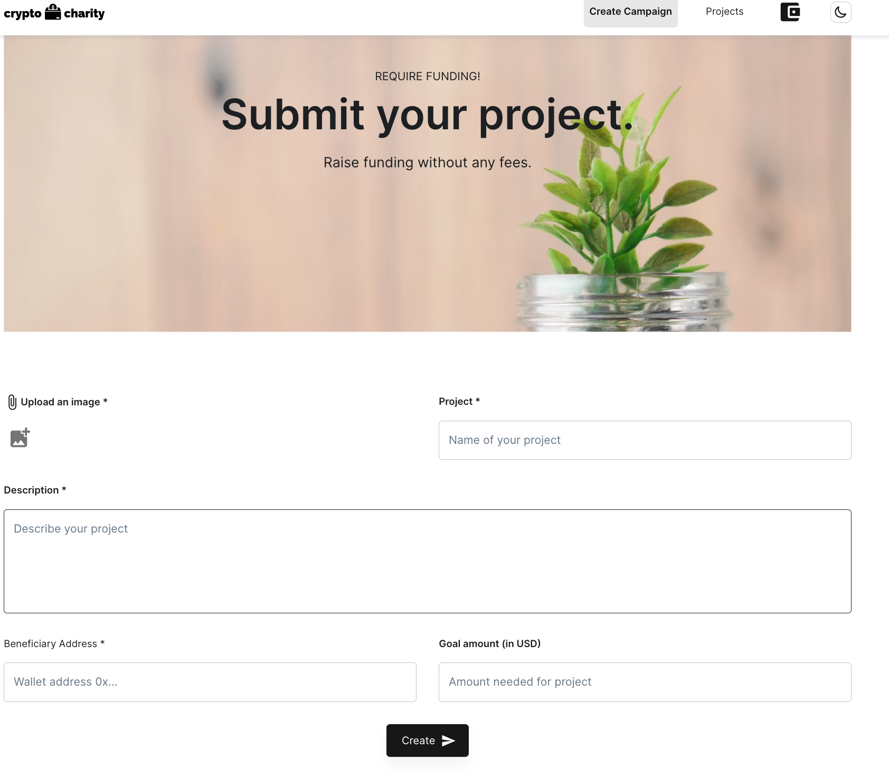
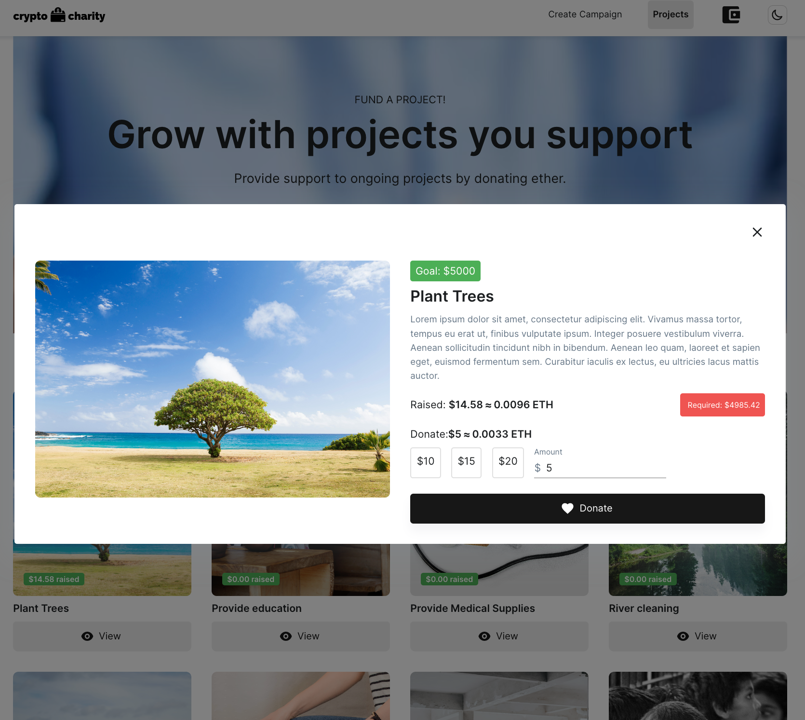

<!-- PROJECT SHIELDS -->

[![Forks][forks-shield]][forks-url]
[![Stargazers][stars-shield]][stars-url]
[![Issues][issues-shield]][issues-url]
[![MIT License][license-shield]][license-url]
[![LinkedIn][linkedin-shield]][linkedin-url]

<!-- PROJECT LOGO -->
<br />
<div align="center">
<picture>
  <source media="(prefers-color-scheme: dark)" srcset="images/crypto-charity-dark.png">
  
</picture>

  <p align="center">
    Be the change you want to see in the world.
  </p>
  
  
  <a href="https://medium.com/better-programming/building-crypto-charity-dapp-for-crowdfunding-using-next-js-solidity-ipfs-and-truffle-6a7d75d81ead">Read full article on Medium</a> 
</div>

<!-- ABOUT THE PROJECT -->

## About The Project

<p align="left">
    Raise fund for social work in crypto built on polygon network. Create fundraising campaign, donate MATIC, generate a receipt, and withdraw the amount.
</p>

#### Network

Contract is deployed on Polygon mumbai network

```sh
0x6e5bDb0E72597779b968C5Ff16Cc83D6C20C82D7
```

https://mumbai.polygonscan.com/address/0x6e5bDb0E72597779b968C5Ff16Cc83D6C20C82D7

### ⚙️Functions:

- create a fundraising campaign
- users can donate in MATIC💰
- beneficiary can withdraw the donated amount💲
- donor can view last donations and generate receipt🧾

</img>
</img>
</img>
</img>

<p align="right">(<a href="#top">back to top</a>)</p>

### Built With

- [Next.js](https://nextjs.org/)
- [Material UI](https://mui.com/)
- [Truffle](https://trufflesuite.com/)
- [Solidity](https://docs.soliditylang.org/)
- [IPFS](https://ipfs.tech/)
- [cryptocompare](https://github.com/exodusmovement/cryptocompare)

<p align="right">(<a href="#top">back to top</a>)</p>

### Installation

Below are instructions to get started:

1. Clone the repo
   ```sh
   git clone https://github.com/ac12644/Crypto-Charity.git
   ```
2. Install packages
   ```sh
   yarn
   ```
3. Add environment variables, also you will require dedicated subdomain for IPFS from infura

   ```sh
   MNEMONIC_KEY=
   INFURA_API_KEY=
   INFURA_IPFS_ID=
   INFURA_IPFS_SECRET=
   ```

4. Run application
   ```sh
   yarn run dev
   ```

### Specification

#### Solidity Functions

1. Create new fundraiser

```solidity
function createFundraiser(
    string memory name,
    string memory image,
    string memory description,
    uint256 goalAmount,
    address payable beneficiary
  ) public {
    Fundraiser fundraiser = new Fundraiser(
      name,
      image,
      description,
      goalAmount,
      beneficiary,
      msg.sender
    );
    _fundraisers.push(fundraiser);
    emit FundraiserCreated(fundraiser, msg.sender);
  }
```

2. Set new beneficiary

```solidity
 function setBeneficiary(address payable _beneficiary) public onlyOwner {
    beneficiary = _beneficiary;
  }
```

3. Return your donations

```solidity
  function myDonations() public view returns (
      uint256[] memory values,
      uint256[] memory dates
  )

  {
    uint256 count = myDonationsCount();
    values = new uint256[](count);
    dates = new uint256[](count);
    for (uint256 i = 0; i < count; i++) {
        Donation storage donation = _donations[msg.sender][i];
        values[i] = donation.value;
        dates[i] = donation.date;
    }
    return (values, dates);
  }
```

4. Beneficiary can withdraw amount to beneficiary address defined when creating fundraiser

```solidity
function withdraw() public onlyOwner {
      uint256 balance = address(this).balance;
      beneficiary.transfer(balance);
      emit Withdraw(balance);
  }
```

5. Allow users to donate

```solidity
function donate() public payable {
    Donation memory donation = Donation({
      value: msg.value,
      date: block.timestamp
    });
    _donations[msg.sender].push(donation);
    totalDonations = totalDonations.add(msg.value);
    donationsCount++;

    emit DonationReceived(msg.sender, msg.value);
  }

```

6. Return list of fundraisers with [limit] one can define number of fundraiser to be fetched

```solidity
function fundraisers(uint256 limit, uint256 offset)
    public
    view
    returns (Fundraiser[] memory coll)
  {
    require(offset <= fundraisersCount(), 'offset out of bounds');

    uint256 size = fundraisersCount() - offset;
    size = size < limit ? size : limit;
    size = size < maxLimit ? size : maxLimit;
    coll = new Fundraiser[](size);

    for (uint256 i = 0; i < size; i++) {
      coll[i] = _fundraisers[offset + i];
    }

    return coll;
  }
```

<!-- CONTRIBUTING -->

## Contributing

Contributions are what make the open source community such an amazing place to learn, inspire, and create. Any contributions you make are **greatly appreciated**.

If you have a suggestion that would make this better, please fork the repo and create a pull request. You can also simply open an issue with the tag "enhancement".
Don't forget to give the project a star! Thanks again!

1. Fork the Project
2. Create your Feature Branch (`git checkout -b feature/AmazingFeature`)
3. Commit your Changes (`git commit -m 'Add some AmazingFeature'`)
4. Push to the Branch (`git push origin feature/AmazingFeature`)
5. Open a Pull Request

<p align="right">(<a href="#top">back to top</a>)</p>
 
 
<!-- LICENSE -->
## License

Distributed under the MIT License. See `LICENSE.txt` for more information.

<p align="right">(<a href="#top">back to top</a>)</p>

<!-- MARKDOWN LINKS & IMAGES -->

[forks-shield]: https://img.shields.io/github/forks/ac12644/Crypto-Charity?style=for-the-badge
[forks-url]: https://github.com/ac12644/Crypto-Charity/network/members
[stars-shield]: https://img.shields.io/github/stars/ac12644/Crypto-Charity?style=for-the-badge
[stars-url]: https://github.com/ac12644/Crypto-Charity/stargazers
[issues-shield]: https://img.shields.io/github/issues/ac12644/Crypto-Charity?style=for-the-badge
[issues-url]: https://github.com/ac12644/Crypto-Charity/issues
[license-shield]: https://img.shields.io/github/license/ac12644/Crypto-Charity?style=for-the-badge
[license-url]: https://github.com/ac12644/Crypto-Charity/blob/master/LICENSE.txt
[linkedin-shield]: https://img.shields.io/badge/-LinkedIn-black.svg?style=for-the-badge&logo=linkedin&colorB=555
[linkedin-url]: https://www.linkedin.com/in/ac12644/
